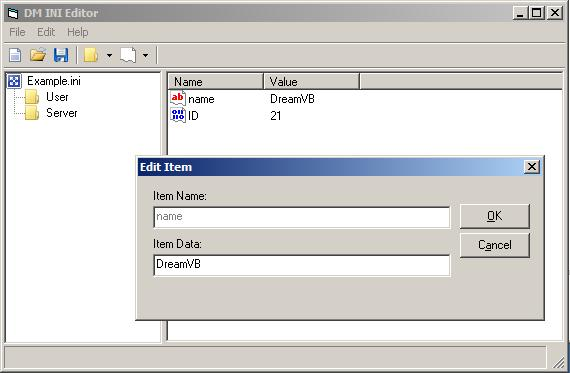



## DM INI Editor V1\.0

### Description

This is a small INI Editor I started today, it not all finished as I have a few more things to add, but you can with this version easy create and modifiy INI and INF Files and also export to XML anyway hope you like this code.
 
### More Info
 

             |
---                |---
**Submitted On**   |2008-09-17 02:10:16
**By**             |[dreamvb](https://github.com/Planet-Source-Code/PSCIndex/blob/master/ByAuthor/dreamvb.md)
**Level**          |Beginner
**User Rating**    |5.0 (15 globes from 3 users)
**Compatibility**  |VB 6\.0
**Category**       |[Complete Applications](https://github.com/Planet-Source-Code/PSCIndex/blob/master/ByCategory/complete-applications__1-27.md)
**World**          |[Visual Basic](https://github.com/Planet-Source-Code/PSCIndex/blob/master/ByWorld/visual-basic.md)
**Archive File**   |[DM\_INI\_Edi2127419172008\.zip](https://github.com/Planet-Source-Code/dreamvb-dm-ini-editor-v1-0__1-71099/archive/master.zip)

